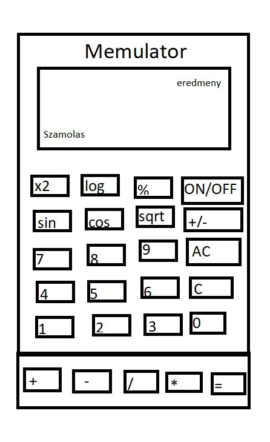
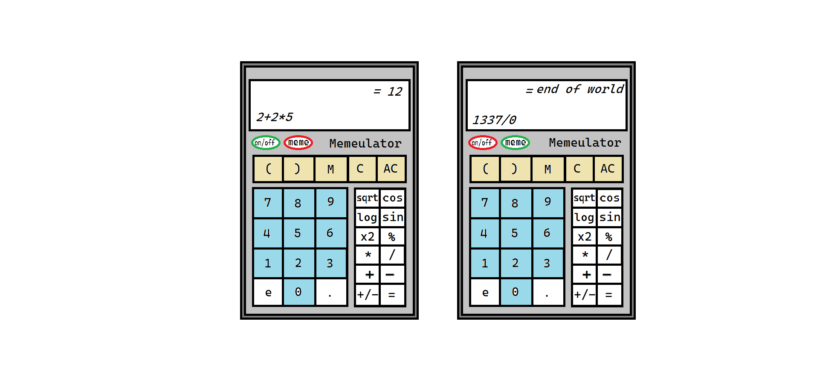
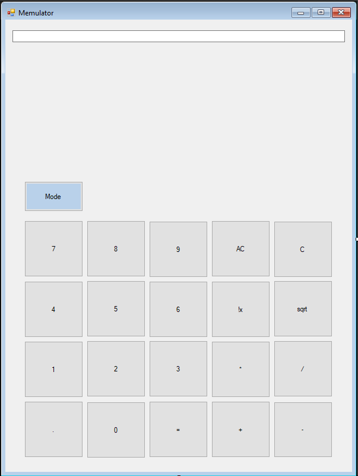

# Funkcionális Specifikáció
## 1. Jelenlegi helyzet

Jelenleg unalmas, egyszerű számológépeket használnak a fiatalok, ezért szeretnénk ezeket lecserélni, és saját, könnyen használhatóakkal helyettesíteni, amely
szórakoztató és optimális a feladat elvégzésére. Ezzel megkönnyítve a tanárok, szülők dolgát azzal, hogy a fiatalok szívesebben használják a számológépet.

## 2. Vágyálom rendszer

A projekt célja, hogy optimális és egyben szórakoztató számológép jöjjön létre a fiatalok számára. A számológépnek egyszerűnek, és könnyen használhatónak kell
lennie. Az alkalmazás funkciói: Összeadás, kivonás, szorzás, osztás, hatványozás, gyökvonás, a hagyományos számológépen látható DEL illetve AC jelzésű gombok.

## 3. Jelenlegi üzleti folyamatok modellje

Jelenleg az órákon a diákok megnyitják a számítógépen előre telepített számológépet, és azt használják. Néhány számítógépen azonban régebbi Windows operációs rendszer található, ezért az alkalmazás külleme és működése eltér akár két számítógép között.

## 4. Igényelt üzleti folyamatok modellje

Egy olyan szoftver, amely alkalmas a szórakoztató, optimális tanulásra, munkavégzésre. Használata közben a szoftver képes hangok lejátszására, képek
megjelenítésére.

A számológépünk nem sokkal különbözik az alapmodelltől, műveletei tartalmazzák:

 -   Összeadás
 -   Kivonás
 -   Szorzás
 -   Osztás
 -   Gyökvonás
 -   Négyzetre emelés
 - 	Kijelzőn lévő adatok törlése

## 5. Követelménylista

| ID | Modul | Név | Kifejtés |
| :---: | --- | --- | --- |
| K1  | Felület | Összeadás  | Számok összeadása. |
| K2  | Felület | Kivonás  | Számok kivonása. |
| K3  | Felület | Szorzás  | Számok szorzása. |
| K4  | Felület | Osztás  | Számok osztása. |
| K5  | Felület | Gyökvonás | Számok gyökei. |
| K6  | Felület | Törlés  | Törlés a képernyőről |
| K7  | Felület | Nullázás | Az összes szám törlése a képernyőről |
| K8  | Felület | Eredmény | Az művelet eredményének kiíratása a képernyőre |

## 6. Használati esetek

1. Felhasználó számolása: A felhasználó a képernyőablakon megjelenő gombok segítségével ki tudja választani, hogy melyik matematikai műveletet szeretné elvégezni.
2. Eredmény kiírása a képernyőre: A program a háttérben a felhasználó által meghívott matematikai műveletet végrehajtja.

## 7. Megfeleltetés, hogyan fedik le a használati eseteket a követelményeket

K1: A felhasználó a második szám kiválasztása előtt rákattint az összeadás (+) gombra. Ezzel jelezve a rendszernek, hogy a két szám összegét szeretnénk megkapni.
K2: A felhasználó a második szám kiválasztása előtt rákattint a kivonás (-) jelre. Ezzel jelezve a rendszernek, hogy az első számból ki szeretnénk vonni a másodikat.
K3: A felhasználó a második szám kiválasztása előtt rákattint a szorzás (*) jelre. Ezzel jelezve a rendszernek, hogy a két szám szorzatát szeretnénk megkapni.
K4: A felhasználó a második szám kiválasztása előtt rákattint az osztás (/) jelre. Ezzel jelezve a rendszernek, hogy az első számot el szeretnénk osztani a második számmal.
K5: A felhasználó a második szám kiválasztása előtt rákattint a gyökvonás (√) jelre. Ezzel jelezve a rendszernek, hogy az első számnak a második számú gyökét szeretnénk megkapni.
K6. A felhasználó rákattinthat a törlés (DEL) gombra. Ekkor a legutolsó karakter törlésre kerül a képrenyőről.
K7. A felhasználó rákattinthat a nullázás (AC) gombra. Ekkor az összes szám törlésre kerül a képernyőről.
K8. A felhasználó bármikor rákattinthat az eredmény (=) gombra. Ekkor az aktuális számolási folyamat eredményét kiírja a kijelzőre.

## 8. Képernyőtervek

### Korai látványterv

### Javított Látványterv

### Korai prototípus

## 9. Forgatókönyvek

A program elindítása után minden felhasználónak a főablak jelenik meg, melyben a következők jelennek meg:
* számok megjelenitésére szolgáló szövegdoboz
* tizedesvessző
* felhasználó által bevihető számok gombjai
  *  nulla (0)
  *  egy (1)
  *  kettő (2)
  *  három (3)
  *  négy (4)
  *  öt (5)
  *  hat (6)
  *  hét (7)
  *  nyolc (8)
  *  kilenc (9)
* műveleti jelek
  * összeadás
  * kivonás
  * szorzás
  * osztás
  * gyökvonás
  * egyenlőségjel
* AC gomb
* DEL gomb
* meme gomb
A szövegdobozban jelenik meg:
* a felhasználó által megadott számok
* az eredményként megjelenő számok

A felhasználó kezdésképp meg tud adni egy számot, mely után egy műveleti jel megnyomásával jelezni tudja, hogy egy másik számot szeretne megadni.
Ha a felhasználó ez után megnyomja bármely számot, az előzőleg megadott szám eltűnik, és az új szám jelenik meg a szövegdobozban.
Ez addig folytatható míg egyenlőségjelet nem nyomunk, ekkor az előzőleg beírt számok műveleteinek eredménye jelenik meg.
ilyenkor két lehetőségünk van, ha elkezdünk írni egy másik számot, az előző eredmény törlődik, hogyha pedig egy műveleti jelet nyomunk meg az eredményt elmenti, és hozzáveszi az új művelethez.

Ha a felhasználó hibásan írta be a szám egyik karakterét, és korrigálni szeretné a hibáját, a DEL nevű gombal tudja megtenni, az itt előforduló lehetőségek:
* Ha a szövegdoboz üres, és a felhasználó megnyomja a DEL elnevezésű gombot, a szövegdoboz tartalma változatlan marad. Ez akkor fordulhat elő, hogyha az AC gombal törölve lett minden,
   vagy ha az alkalmazás frissen lett megnyitva, és még nem történt számbevitel a megnyílása óta.
* Ha a szövegdoboz egy eredményt tartalmaz, amit az egyenlőségjel lenyomásas után ír ki, és a felhasználó megnyomja a DEL elnevezésű gombot, semmi nem történik, a szövegdoboz változatlan marad.
* Ha a szövegdoboz egy felhasználó által beírt számot tartalmaz, és megnyomja a felhasználó a DEL elnevezésű gombot, két lehetőség fordulhat elő:
  * Ha a szövegdobozban egy karakter van, és megnyomja a felhasználó a DEL elnevezésű gombot, a szövegdoboz üressé válik.
  * Ha a szövegdobozban több karakter van, és megnyomja a felhasználó a DEL elnevezésű gombot, a szövegdobozban utoljára beírt karakter kitörlődik.

 Ha a felhasználó teljesen új számolást szeretne kezdeni, azt az AC elnevezésű gombal tudja megtenni. Megnyomása után két lehetőség fordulhat elő:
 * Ha a szövegdoboz üres, és a felhasználó megnyomja az AC elnevezésű gombot, semmi sem történik, a szövegdoboz és a memória üres marad.
 * Ha a szövegdobozban eredmény, vagy a felhasználó által beírt szám jelenik meg, és a felhasználó megnyomja az AC elnevezésű gombot, a szövegdoboz és a számolási memória üressé válik.

Ha a felhasználó a műveleti jelek valamelyikét használja, az előforduló lehetőségek:
* Ha a szövegdoboz üres, nem lett még megadva szám, és egy műveleti jel megnyomásra került,  akkor nem kerül regisztrálásra a gomb lenyomása, nem változik semmi.
* Ha a szövegdoboz tartalmaz egy, a felhasználó által megadott számot, és egy műveleti jel megnyomásra került, a szövedgoboz tartalma változatlan marad,
  viszont a számhoz a háttérben a műveleti jel regisztrálásra került, ha a felhasználó megnyom egy számot, az előző szám eltűnik és az új jelenik meg.

  Ha a felhasználó megnyomja a meme gombot, az előforduló lehetőségek:
  * Ha a meme gomb piros, és a felhasználó megnyomja a meme elnevezésű gombot, akkor a gomb zöldé válik, az értéke pedig igaz lesz.
   * Ha a meme gomb értéke igaz, a számológép használata során különböző különleges számokra hang, illetve képi hatásokat jelenít meg a program.
  * Ha a meme gomb zöld, és a felhasználó megnyomja a meme elnevezésű gombot, akkor a gomb pirossá válik, az értéke pedig hamis lesz.
     * Ha a meme gomb értéke hamis, a számológép használata során egy átlagos számológépként fog működni.

Ha a felhasználó megnyomja a tizedesvessző gombot, az előforduló lehetőségek:
* Ha a szövegmező üres, és a felhasználó megnyomja a tizedesvessző gombot, nem történik semmi.
* Ha a szövegmező felhasználó által beírt számot tartalmaz, és a felhasználó megnyomja a tizedesvessző gombot, a szövegmezőben a szám után egy tizedesvessző jelenik meg.
* Ha a szövegmező az egyenlőségjel megnyomása utáni eredményt jeleníti meg, és a felhasználó megnyomja a a tizedesvessző gombot, nem fog történni semmi.

